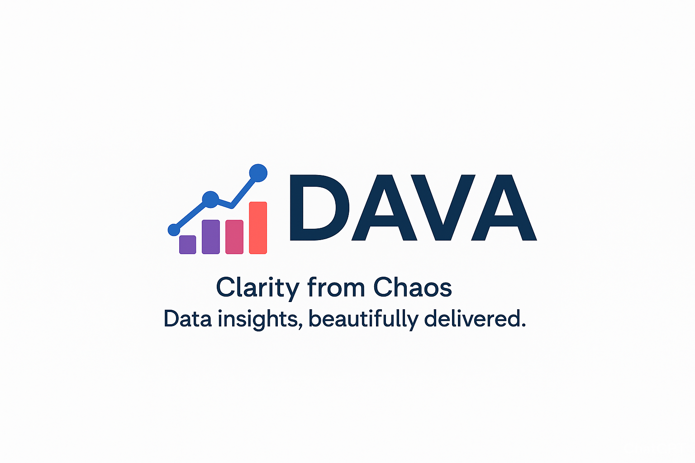
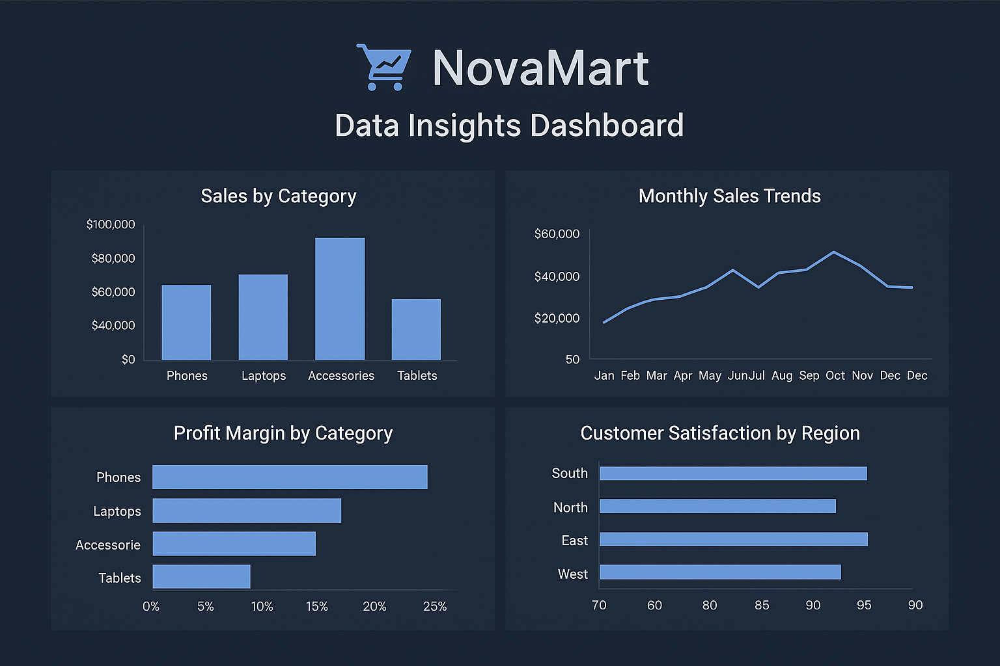

# DAVA

---

## 🧩 Project Overview

NovaMart is a fictional online electronics store analyzed as a data storytelling showcase by **DAVA**.

This project demonstrates the complete data process — from exploration to visualization and reporting — in a realistic business scenario.

---

## ❗ Business Problem

Retail businesses often struggle to understand sales performance, customer behavior, and product profitability.

This project aims to uncover actionable insights that help improve decision-making, optimize product strategy, and enhance overall business performance.

---

## 🎯 Objectives

- Identify top-performing product categories  
- Analyze sales and profit trends over time  
- Understand customer purchasing behavior  
- Provide data-driven recommendations  
- Build a dashboard for business decision-making  

---

## 📊 Dashboard Preview

---

## 🔍 Key Insights

- Certain product categories consistently outperform others  
- Sales show clear seasonal patterns  
- High-performing regions contribute significantly to revenue  
- Customer purchasing behavior indicates repeat buying trends  

---

## 📈 Business Impact

The insights from this analysis can help businesses:

- Improve inventory and product strategy  
- Identify high-value customers and regions  
- Optimize sales and marketing efforts  
- Make informed, data-driven decisions  

---

## 🛠 Tools & Technologies

- Python (Pandas, Matplotlib)  
- Excel  
- Power BI (Dashboard)  

---

## 📦 Deliverables

- Exploratory Data Analysis (EDA) Notebook  
- Interactive Dashboard  
- Survey Report  

---

DAVA-Demo-NovaMart/
│
├── assets/
│   └── dava_logo.png
│
├── dashboard/
│   └── 01_NovaMart_Dashboard.png
│
├── notebooks/
│   └── 01_NovaMart_EDA.ipynb
│
├── reports/
│   └── 01_NovaMart_Survey_Report.pdf
│
├── README.md
└── .gitignore

---

## 🔮 Future Projects

- Customer Retention Dashboard  
- Market Trend Forecasting Model  
- Product Category Profitability Explorer  
- Consumer Sentiment Visualization Report  

---

## 📬 About DAVA

DAVA is a data analytics and visualization consultancy focused on transforming raw data into clear, actionable insights.

We help businesses make better decisions through data analysis, dashboards, and business intelligence reporting.

**Clarity from Chaos – Data insights, beautifully delivered.**

---

© DAVA 2026 | Showcase Project – Phase 1: Foundation  
DAVA is a trading name of DAVA INSIGHTS (Pty) Ltd
